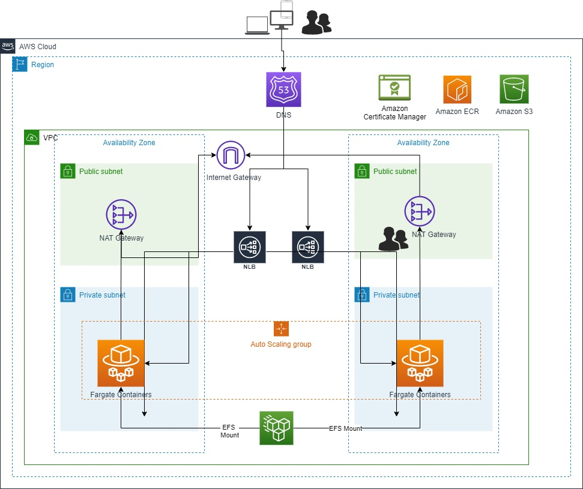

:xrefstyle: short

Deploying this Quick Start for a new virtual private cloud (VPC) with
default parameters builds the following CloudMeet environment in the
AWS Cloud.

// Replace this example diagram with your own. Follow our wiki guidelines: https://w.amazon.com/bin/view/AWS_Quick_Starts/Process_for_PSAs/#HPrepareyourarchitecturediagram. Upload your source PowerPoint file to the GitHub {deployment name}/docs/images/ directory in this repo. 

[#architecture1]
.Quick Start architecture for CloudMeet on AWS

As shown in <<architecture1>>, the Quick Start sets up the following:

* A highly available architecture that spans two Availability Zones.*
* A VPC configured with public and private subnets, according to AWS
best practices, to provide you with your own virtual network on AWS.*
* An internet gateway to allow access to the internet.*
* In the private subnets:
** API application
** Databases
** Authentication Module 
** Chat Engine 
** XMPP Server
** Video Bridge 
** Conference Server
** A private Video Bridge component will be deployed in an auto scaling group 
* In the public subnets, managed NAT gateways to allow outbound internet access for
resources in the private subnets.*
** NAT gateway 1 will be attached to one Elastic IP address
** NAT gateway 2 will be attached to another Elastic IP address
* For the Public Access, two Network Load Balancers are configured accoring to AWS best practices. 
** NLB 1 will be attached to one Elastic IP address and will also be configured to use an SSL certificate from ACM.
*** NLB 1 will have one TLS Listener, which will forward the TCP traffic to the web interface of video calling system
*** NLB 1 will also have a UDP listener, which will forward the UDP traffic to the Video Bridge of the video calling system.
** NLB 2 will be attached to one Elastic IP address and will also be configured to use an SSL certificate from ACM.
*** NLB 2 will have one TLS Listener, which will forward the TCP traffic to the web interface of the CloudMeet application. 
* An Amazon Elastic Container Registry (Amazon ECR) repository that contains a Container images with optional plug-ins installed.
* An Amazon Simple Storage Service (Amazon S3) bucket to store environment files.*

// Add bullet points for any additional components that are included in the deployment. Make sure that the additional components are also represented in the architecture diagram. End each bullet with a period.

[.small]#* The template that deploys the Quick Start into an existing VPC skips the components marked by asterisks and prompts you for your existing VPC configuration.#
